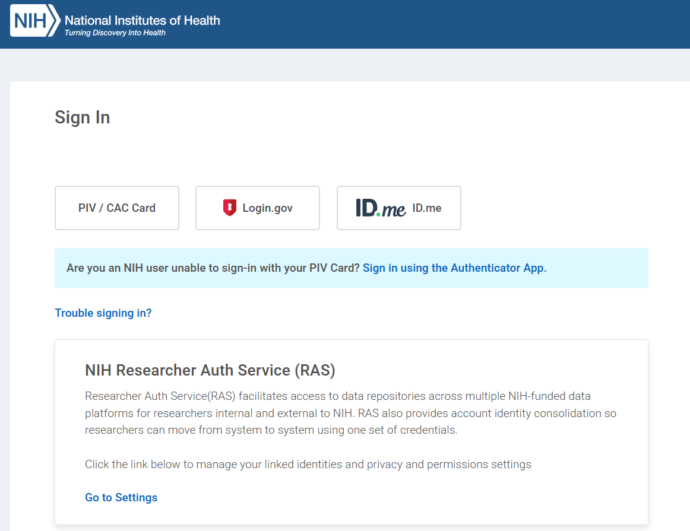
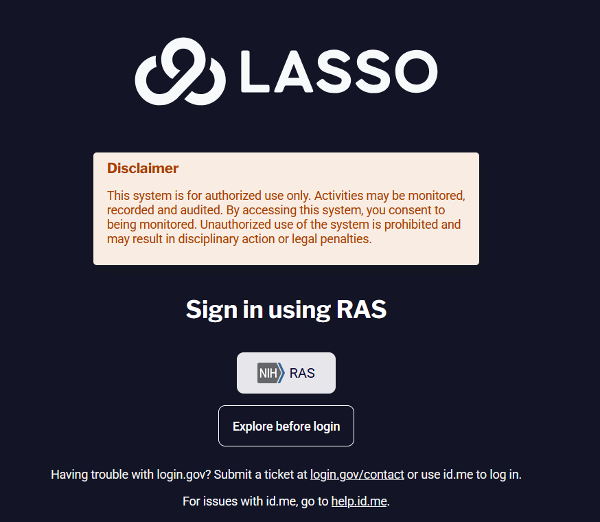
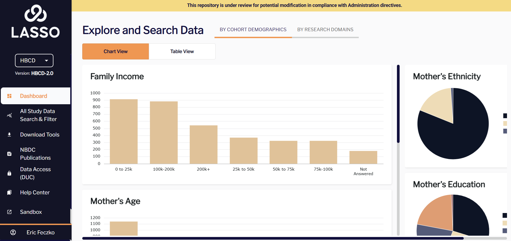
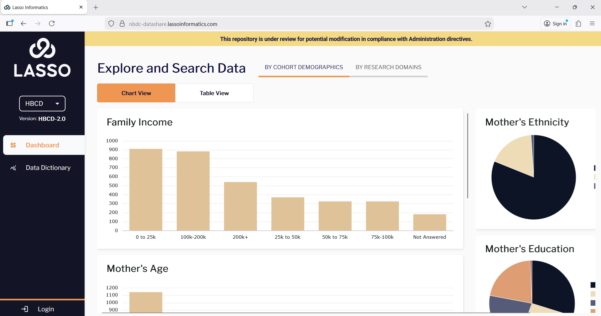

# Module 1: Accessing the Sandbox
 
This module will walk users how to access the Sandbox via the NBDC Data Access Platform (hosted by Lasso).

## Module Objectives

By the end of this module, users will be able to:

1. Navigate to the [NBDC Data Access Platform](https://nbdc-datashare.lassoinformatics.com/).
2. Login to the NBDC through the RAS login system.
3. Access the Sandbox and review the available tools.

## Walkthrough

1. Navigate to the [NBDC Data Access Platform](https://nbdc-datashare.lassoinformatics.com/) and select the login button on the lower left hand side of the screen. 

1. This should take you to a login screen where you can use federal RAS system for login. Go ahead and use the RAS system to login like you normally would. We normally use the login gov but use cases may vary from person to person.
 ---->

1. After logging in, you should be able to access the sandbox on the lower left hand corner. You’ll also have access to the help center,
   as well as the study data and search filter.

1. The Sandbox environment contains multiple applications that we will plan to explore, including: the virtual desktop, the Rstudio Server, and the Jupyter Notebook applications – lets start by selecting the **“Linux Desktop on ood-pdcluster”**, which provides a virtual desktop Sandbox environment.               

**The next section [Using the Sandbox Desktop](load_desktop.md) will show how to navigate the virtual desktop.**