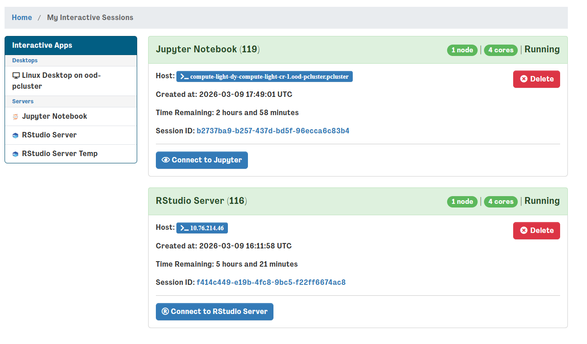
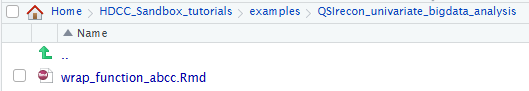
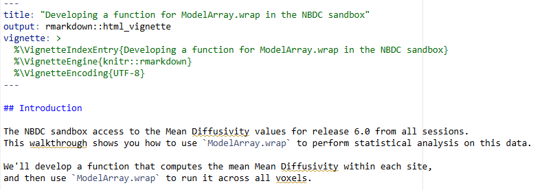

# Module 5: Diffusion Univariate Statistical Testing

<a href="https://github.com/DCAN-Labs/HDCC_Sandbox_tutorials/tree/main/examples/XCP_D_multivariate_prediction" class="button-link">
  <i class="fa-brands fa-github"></i> View Code on GitHub
</a>

White matter changes through development may be indicative of maturation
of structural connections between brain regions. Diffusion imaging can
measure white matter trajectory and density. Therefore, we can examine
the maturation of structural connections by analyzing the developmental
trajectory of diffusion imaging measures. Unfortunately, diffusion
datasets are quite large, and computer systems may lack sufficient RAM
and CPU resources to model across the whole brain. Here, users will
learn how to use HDF5 outputs to load only the data needed for analysis,
which minimizes the resource footprint and makes such analysis more
accessible.

## Module Objectives

1. Users will learn how to use diffusion imaging outputs from the ABCD study.
2. Users will learn how to load HDF5 data and develop models using the  ModelArray package.
3. Users will learn how to use R to perform statistical analysis of variance.

## Walkthrough

1. Return to your interactive sessions, you can do this by clicking on a new session in the dashboard and opening a new window. Instead of
     launching, click on the “My Interactive Sessions” highlighted in blue – it will open the link to your sessions page.
     

2. From your sessions, select your R studio server and launch it – if it's already open, you can skip these steps. Don't worry if you
     accidentally relaunch, r studio servers are saved as images and are restored between sessions.
     

3. Selecting the R studio server, navigate to the `qsiprep_bigdata_univariate_analysis` folder and open the corresponding R markdown (“.Rmd”) file.      
     

4. This will open the R markdown file in the top left corner – the file can be “knitted” into an html output. For the HDCC tutorial, we will run through the steps instead.       
    

## Code Highlights
The markdown file contains a complete example from start to finish for using modelarray to perform a brain-wide assocation analysis. Researchers can modify the file to answer your questions your way! Here we highlight a few simple snippets that can be easily customized.

### Selecting the data to load 
You can choose the imaging data for your question by changing the `h5_path` to your preferred h5 file. You can also change the imaging measure loaded from the h5 file by changing `scalar_types` in the code block at the beginning of the file, reprinted below.

```
# Use the real path
h5_path <- "/shared/hackathon/working-area/hbcd-workshop/mapmri-rtop/mapmri_rtop.h5"
# create a ModelArray-class object:
rhdf5::h5ls(h5_path)
modelarray <- ModelArray(h5_path, scalar_types = c("mapmri_rtop"))
# let's check what's in it:
modelarray

```

To choose different behavioral or developmental measures for answering your questions, you will need to select a different csv file. To do this, change the `csv_path` under the code chunk titled `load csv file`. The code from the ipython notebook is reprinted below.

```
csv_path <- "/shared/hackathon/working-area/hbcd-workshop/mapmri-rtop/mapmri_rtop.csv"
# load the CSV file:
phenotypes <- read.csv(csv_path)
nrow(phenotypes)
names(phenotypes)
```

### Making Bar plot visualizations
Bar plot visualizations are effective ways of visualizing a single comparison. The code chunk below is reprinted from the ipython notebook and can be easily customized to fit your preferences. Change `x` from `session_id` to plot a different variable on the X axis. Change `y` to plot a different variable on the Y axis. Change `color` from `session_id` to color-code the bars by a different grouping variable.


```
library(ggplot2)
ggplot(example_df, aes(x = session_id, y = mapmri_rtop, color = session_id)) +
  geom_boxplot() +
  theme_minimal()
```

### Choosing your model and data to analyze
Modelarray uses a `wrap` function to perform data analyses. A code chunk for running a single Modelarray comparison is reprinted below. Change `72110` to select a different imaging datapoint to analyze. Change `mampri_rtop` to the imaging datatype one wants to analyze. Change `my_mean_mapmri_rtop_fun` to select a different model for analyzing the data. Change `phenotypes` for selecting the non-imaging data to analyze. 

```
analyseOneElement.wrap(
  72110,
  my_mean_mapmri_rtop_fun,
  modelarray,
  phenotypes,
  "mapmri_rtop",
  num.subj.lthr = 2,
  flag_initiate = TRUE,
  on_error = "debug"
)
```

### How to output brain-based data for visualizations
The ipython notebook, from start to finish, will conduct a whole-brain diffusion analyses to examine the effect of development on myelination patterns across the brain. To output the data for brain-based visualization we must first output the results as an h5 file. Change the `/path/to/a/new/h5/file.h5` to output the results to your preferred filename. 
```
writeResults("/path/to/a/new/h5/file.h5", df.output = res_wrap, analysis_name = "mapmri_rtop_anova_and_means")
```

Next, we will need to convert the h5 file into a NIFTI (`.nii.gz`) file. We can modify the code chunk for `voxelstats_write` to output the NIFTI. We must provide the correct `cohort-file` for non-imaging data, `analysis-name` saved above, the correct `input-hdf5` imaging input file, and an `example-nifti` template for creating the NIFTI output. `output-dir` can be modified towards where the output NIFTI will be located.

```
$ voxelstats_write \
  --cohort-file /nbdc-sandbox/derivatives/qsirecon-modelarray/ABCC_mapmri_rtop_phenotypes.csv \
  --analysis-name mapmri_rtop_anova_and_means \
  --input-hdf5 /nbdc-sandbox/derivatives/qsirecon-modelarray/qsirecon-mapmri_rtop.h5 \
  --output-dir /where/you/want/to/put/your/niftis \
--example-nifti /nbdc-sandbox/derivatives/qsirecon-modelarray/qsirecon-mapmri_rtop.nii.gz # Need to find the real path
```
## Brain-based Visualizations

### Introduction
Mass-univariate brain-wide association studies (BWAS) help discover new biomarkers associated with mental health, such as development or cognitive outcomes. Visual inspection of these analyses on the brain remains extremely helpful in understanding and communicating findings to the broader scientific community. Here, ModelArray was used to examine the effects of age on variation in myelination as measured by RTOP. The following section will take you through one way to view these outputs on a template brain using `wb_view`

1. First, we will return to the virtual desktop by selecting the active virtual desktop session.


2. We will then open a terminal. If you already have a terminal open feel free to use it.
  

  
3. From the terminal we will open `workbench_view` this is an apptainer that can be accessed using the following command: `apptainer exec --bind /shared:/shared /shared/hackathon/working-area/neurodesk/neurodesk-connectomeworkbench--1.5.0.simg wb_view`
  


4. This will open a workbench view window where we can open files. The left hand tab allows users to navigate to recently used files or their home directory. For now select the `open other` button on the lower-right-hand side. 
  


5. For this module, we will use HCP volumetric templates. The HCP templates can be found within `/shared/hackathon/working-area/imaging_templates/HCP_Templates/`. Follow the pictures below to locate the final path to the HCP template folder. 


6. With many templates to choose from, we need to choose the right template with the same dimensions as our statistical maps. Here we will select the `MNI152_T1_2mm.nii.gz` file, as it matches the diffusion outputs here.


7. Next we will need to load our statistical data. Return to the `/shared/hackathon/working-area/` and navigate to `hbcd-workshop`


8. There is a lot of that we can visualize here! Lets navigate to the `mapmri-rtop` folder and then the `results` subfolder within. To visualize the effect of age we will load the `results_lm_scans_gestational_age.statistic.nii.gz` file.


9. There will still be an empty brain in the brain based visualization. To display the statistical map, lets select the top layer in the `overlay toolbox` selecting the radio button all the way on the left (red circle), and displaying the color bar (blue circle). We can now see the test statistics on the brain!


10. This statistical map is currently in greyscale. If we select the wrench button (red circle), we open an editor window that allows us to manipulate the map any way we want. Selecting the `Name` underneath the `Palette` section opens a lot of options, lets select the top option `ROY-BIG-BL` for this example. Then close the editor window.


11. Now we can navigate the brain and examine the statistical output for different structures! If we want to change the view or slice we can use the tools under the volume tab. We can select the orientation, such as coronal (red circle), to change our perspective. We can navigate different slices using the slice window (blue circle) for the corresponding orientation.
  


  
## Conclusion
White matter development varies considerably throughout the brain. Typically, modelling these trajectories in the context of developmental outcomes requires vast computing resources. The Modelarray package and hdf5 file formats greatly minimize memory usage, enabling you to answer your brain-behavior questions on the same resources as a laptop. In addition, the example here shows you how to produce brain-based visualizations so you can further understand and commmunicate your findings.


## Next Steps
**The next section [XCP-D Output Multivariate Prediction](xcpd-multivar-predictions.md) will show how to perform multivariate prediction analysis using XCP-D derivative outputs for functional connectivity.**
