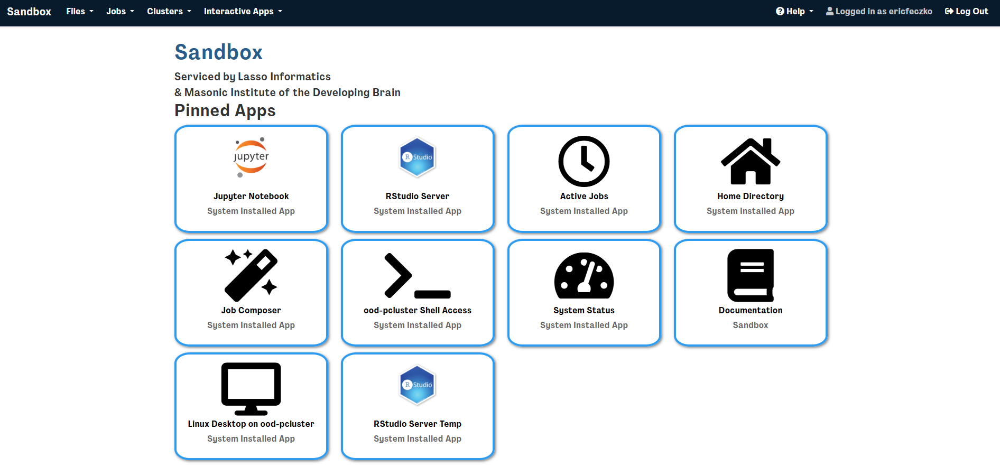
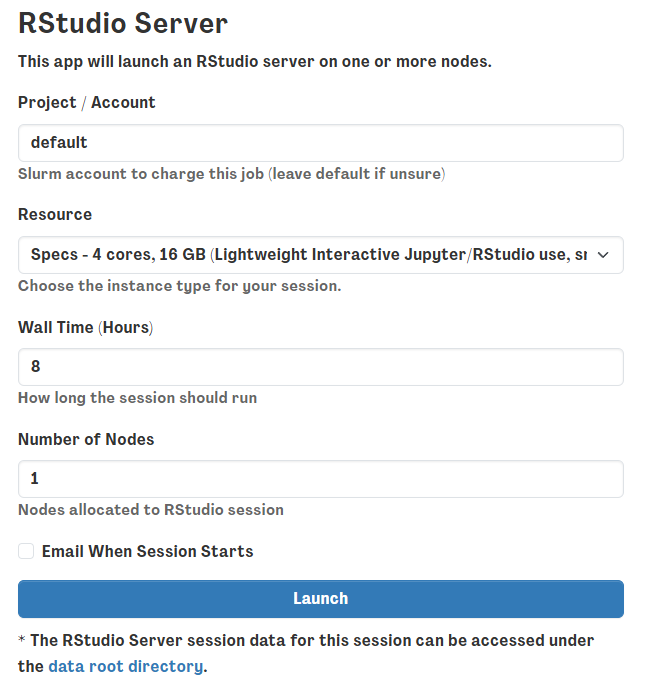
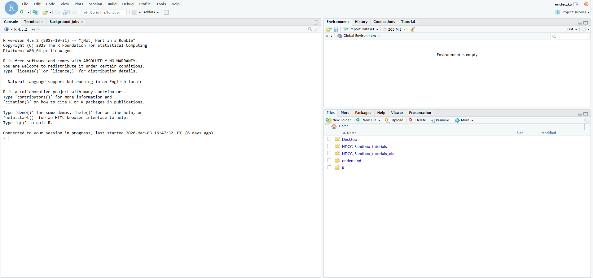
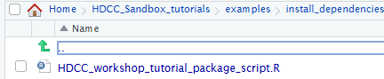
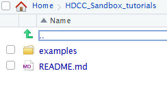
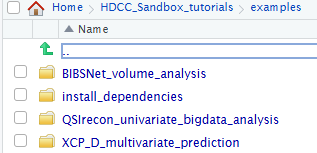
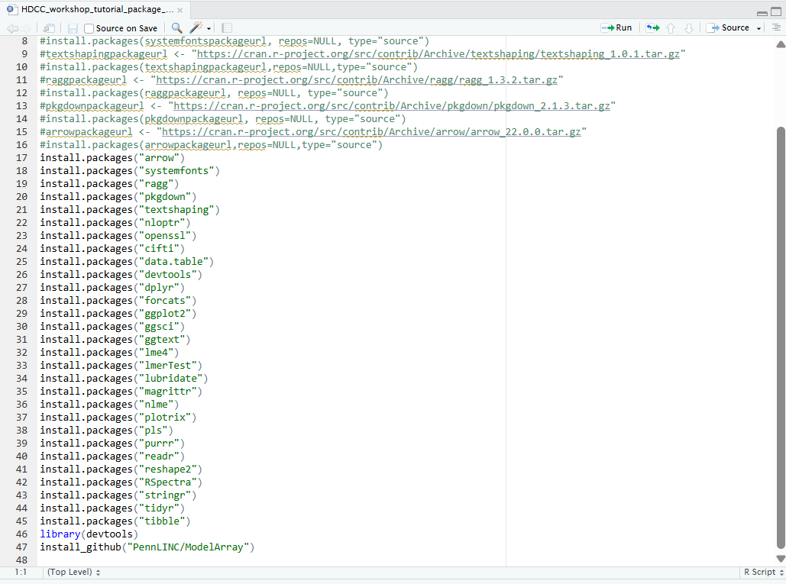

# Module 3: RStudio Setup

<a href="https://github.com/DCAN-Labs/HDCC_Sandbox_tutorials/tree/main/examples/install_dependencies" class="button-link">
  <i class="fa-brands fa-github"></i> View Code on GitHub
</a>

The RStudio server enables users a stable R environment for conducting analyses on the sandbox. The R studio server session is stored within users home directories, enabling some permanence between RStudio server sessions. In order to leverage the R studio server, users will have to install their own R packages. This module will walk users through basic installation steps needed for this workshop.

## Module Objectives

1. Navigate and open an R studio server session on the sandbox platform
2. Open the install script provided in the downloaded GitHub repository
3. Start installing the R packages needed for subsequent modules

## Walkthrough

1. Return to the sandbox dashboard and select the R studio server session


2. This will open a window requesting optional resources and tools, for now we can leave this blank, make sure to have requested at
     least 2 hours for the session.          


3. This will open an RStudio session. Go ahead and click on it and you’ll have an R studio session loaded like this


4. In the lower right hand corner, navigate to the “HDCC_Sandbox_tutorial/examples/install_dependencies” and open the R script
         
         


5. This will open a script on the left hand side – go ahead and just run the script (see latest version of script with documented function of each R package in [GitHub repo](https://github.com/DCAN-Labs/HDCC_Sandbox_tutorials/blob/main/examples/install_dependencies/HDCC_workshop_tutorial_package_script.R)). Installation time is about 10-20 minutes. 

??? info "R Packages"
    R packages installed at the time of the HDCC 2026 Sandbox tutorial include:
     ```
     install.packages("arrow")      # Loading parquet files into memory
     install.packages("cifti")      # Loading CIFTI files (the CIFTI format is our standard for HBCD imaging output files)
     install.packages("ciftiTools") # Tools for working with and visualizing CIFTI neuroimaging data
     install.packages("data.table") # Helpful for fast data manipulation and reshaping large data frames
     install.packages("dplyr")      # Helpful for looping through the same operations multiple times
     install.packages("ggplot2")    # For data visualizations
     install.packages("ggsci")      # Provides scientific journal color schemes for ggplot2
     install.packages("lme4")       # Linear mixed-effects models
     install.packages("lmerTest")   # Adds p-values and tests to lme4 mixed models to predict outcomes
     install.packages("nlme")       # Nonlinear mixed-effects models (alternative to lme4)
     install.packages("plotrix")    # Additional plotting functions to generate heat maps
     install.packages("pls")        # Partial least squares regression and PCA-related methods
     install.packages("reshape2")   # Reshaping data between vectors and matrices
     install.packages("RSpectra")   # Efficient eigenvalue decomposition (data dimensionality reduction)
     install.packages("tidyr")      # Tidying and reshaping data, looping multiple operations
     install.packages("systemfonts")# Fonts for plots and graphics
     install.packages("ragg")       # High-quality graphics rendering for ggplot
     install.packages("pkgdown")    # Build static documentation websites from R packages
     install.packages("textshaping")# Text rendering support for graphics (used with ggplot, ragg)
     install.packages("nloptr")     # Nonlinear optimization algorithms
     install.packages("openssl")    # Secure data transfer, encryption, and HTTPS connections
     install.packages("devtools")   # Tools for developing, installing, and managing R packages
     install.packages("forcats")    # Tools for working with categorical variables (factors)
     install.packages("ggtext")     # Improved text formatting in ggplot (markdown, rich text)
     install.packages("lubridate")  # Easy handling of dates and times
     install.packages("magrittr")   # Provides the pipe operator (%>%) for cleaner code
     install.packages("purrr")      # Functional programming tools for iteration and lists
     install.packages("readr")      # Fast reading of CSV and text data files
     install.packages("stringr")    # String/text processing
     install.packages("tibble")     # Modern version of data frames
     ```


**In the meantime we will complete the next section [Volumetric Analysis (Jupyter)](volumetric_analysis.md).**
