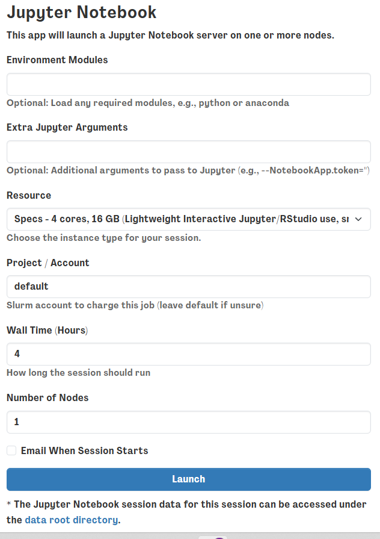
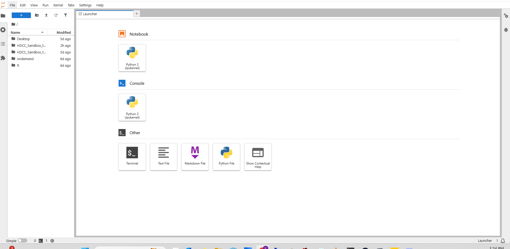
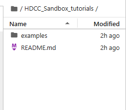
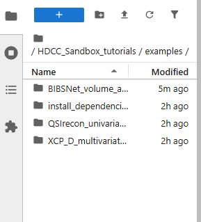
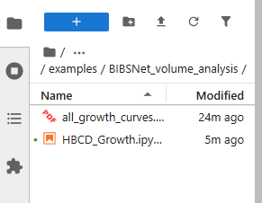

# Module 4: Volumetric Analysis Using Jupyter Notebook

!!! info "**See the [HBCD Data Release Docs](https://docs.hbcdstudy.org/latest/instruments/mri/mri-proc/) *MRI Processing & Derivatives Guide* for information on structural and functional MRI derivatives.**"

The size of structural volumes is potentially meaningful with respect to brain function. Therefore, one fundamental question underlying ABCD and HBCD studies are the developmental trajectories of brain regions. Providing brain charts is an incredibly important tool for tracking developmental growth and providing normative models for biomarker discovery (Bethlehem et. al., Nature, 2022 ). One key gap in brain charts is the lack of a consistent pipeline for processing all the data -- trajectories may be contaminated by batch effects from differences in pipeline processing. In addition, some ages in current brain charts may be limited due to small sample sizes. BIBSnet provides volumetric outputs for the HBCD dataset. Here, we will load BIBSnet data and measure the trajectory of volumetric data across development filling the gap in infant development. We will leverage ipython jupyter notebooks to perform this analysis.

## Module Objectives

1. Gain familiarity with ipython jupyter notebooks
2. Explore volumetric outputs from BIBSnet
3. Develop longitudinal models to measure volume development from HBCD data

## Walkthrough

1. Return to the sandbox dashboard and select the jupyter notebook session

2. This will open a window requesting optional arguments or modules to load. For this example we won’t need anything extra so just hit the launch button below      

3. This will open up a jupyter notebook launcher with a navigation panel on the left hand side

4. If you enter the HDCC_Sandbox_tutorials folder on the left hand  side, you should see the examples folder

5. Open the examples folder and you’ll find the “BIBSnet volumetric analysis” folder. Open that to find an i python notebook, and click on that to start the tutorial.      
    
    

## Brain-Based Visualizations

### Introduction
The output from this BIBSnet example contains a visualization of the growth curve fits on the brain as a brain volume .nii.gz (NIFTI) file. This walkthrough will take users through how to use the sandbox to visualize the statistical map on a template in MNI space. 
!!! info "**Template files provided for visualization are sourced from the Baby Open Brains (BOBs) Repository - [see details](https://bobsrepository.readthedocs.io/).**"
The following steps will take users through using workbench for visualizing statistical brain maps on brain volumes.

1. First, we will return to the virtual desktop by selecting the active virtual desktop session.

2. We will then open a terminal. If you already have a terminal open feel free to use it.

3. From the terminal we will open `workbench_view` this is an apptainer that can be accessed using the following command: `apptainer exec --bind /shared:/shared /shared/hackathon/working-area/neurodesk/neurodesk-connectomeworkbench--1.5.0.simg wb_view`

4. This will open a workbench view window where we can open files. The left hand tab allows users to navigate to recently used files or their home directory. For now select the `open other` button on the lower-right-hand side. 

5. For this module, the templates can be found inside the HDCC Sandbox Tutorial folder. Follow the pictures below to locate the final path to the BIBSnet module folder. 
  

6. The data folder contains the anatomical templates for viewing brain anatomy in the `src` folder. It also contains data visualizations, in the `output` folder, including a statistical map of the growth curve fits to each volumetric structure. For now let us select the subject directory in the `src` folder.

7. An anatomical template in the same space as our statistical map is needed for viewing the outputs properly. Often misalignment between the anatomy and the stat map drives visualization issues. Here let us use the T1 for data visualization. 

8. This will load the anatomy and we can see the brain! Let us now load the statistical map. We will select open file from the file window, and then navigate back to the `data` folder. From there, let us select the `outputs` folder and choose the NIFTI (`.nii.gz`) file found within the `outputs` folder.

9. We can now have the data loaded! However we still need to select a layer in the `overlay toolbox` to choose the statistical map itself. Next, we will need to select the radio button on the left (red circle) and the colorbar (blue circle) to make the map visible.

10. Now we can navigate the brain and examine the statistical output for different structures! If we want to change the view or slice we can use the tools under the volume tab. We can select the orientation, such as coronal (red circle), to change our perspective. We can navigate different slices using the slice window (blue circle) for the corresponding orientation.

## Conclusion
The example here allows us to build our own brain charts using HBCD data. Such brain charts mirror prior research, which has revolutionized brain behavior analysis (Bethlehem et al., 2022). In addition, we show how to produce brain visualizations of brain chart parameters for subsequent exploration, visualization, and publication.  

## Next Steps
**The next section [Diffusion Statistical Testing](model_array.md) will show how to perform diffusion univariate statistical testing using QSIRecon pipeline outputs.**
