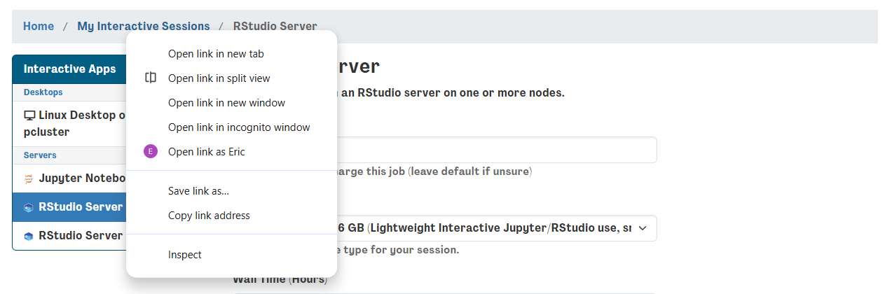
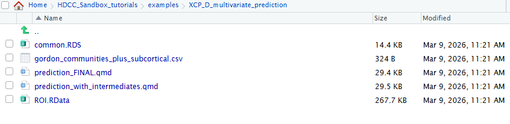
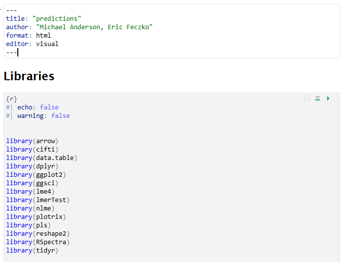

# Module 6: XCP-D Output Multivariate Prediction

!!! info "**See the [HBCD Data Release Docs](https://docs.hbcdstudy.org/latest/instruments/mri/mri-proc/) for information on XCP-D derivatives in the data release, including the [file tree](https://docs.hbcdstudy.org/latest/instruments/mri/mri-proc/#xcpd-derivs) and [MRI Derivatives Quick Start Guide](https://docs.hbcdstudy.org/latest/instruments/mri/mri-proc/#mri-derivatives-quick-start-guide).**"

<a href="https://github.com/DCAN-Labs/HDCC_Sandbox_tutorials/tree/main/examples/QSIrecon_univariate_bigdata_analysis" class="button-link">
  <i class="fa-brands fa-github"></i> View Code on GitHub
</a>

[XCP-D](https://xcp-d.readthedocs.io/en/latest/) pipeline derivatives includes resting-state functional connectivity matrices to leverage for downstream analyses. Functional connectivity is a key marker of functional brain organization, which evolves across development. Measuring developmental trajectories of functional connectivity and understanding how these trajectories relate to behavioral outcomes such as cognition is an important goal for many researchers.

However, functional connectivity data are extremely high-dimensional, making whole-brain multivariate modeling computationally intensive. Dimensionality reduction techniques can substantially reduce computational demands while preserving meaningful structure in the data. When applied correctly, these methods allow complex analyses to be performed even with limited RAM and CPU resources.

In this module, you will learn best practices for dimensionality reduction and develop longitudinal predictive models of cognitive outcomes using parcellated whole-brain connectivity data.

## Module Objectives

By the end of this module, users will be able to:

1. Load XCP-D parcellated connectivity outputs.
1. Perform dimensionality reduction on training data.
1. Apply the reduced feature space within a longitudinal predictive model of cognition.
1. Evaluate and visualize model predictions.

## Walkthrough

1. Return to your **Interactive Sessions**. You can do this by opening the dashboard in a new window. Instead of launching a new session, click **“My Interactive Sessions”** (highlighted in blue) to open the page listing your existing sessions.         


2. From the sessions page, locate your **RStudio Server** session and launch it. If the session is already open, you can skip this step. Don't worry if you accidentally relaunch it - RStudio sessions are saved as images and will be restored between launches.      


3. Navigate to the `XCP_D_multivariate_prediction/` directory within the `examples/` folder and open the file `prediction_FINAL.qmd`.       


4. This will open the **multivariate prediction example**, which can also be rendered as HTML or PDF output. From here, we work through the Quarto (.qmd) file step-by-step.          


## Code Highlights
The markdown file contains a complete example from start to finish for building your own machine learning model from NBDC data. Researchers can modify the file to answer your questions your way! Here we highlight a few simple snippets that can be easily customized.

### Selecting data files
You can select the imaging data you want to use for your research question by editing. The `ROOT` paths in the first code chunk, which is reprinted below. `V2ROOT` may be needed if you are using data from more than one derivative folder.
```
#ROOT <- "/shared/hackathon/hbcd/v2.0/hbcd/derivatives/xcp_d-2afa9081+0ef9c88a"
#V2ROOT <- "/shared/hackathon/hbcd/v2.0/hbcd/derivatives/xcp_d-0f306a2f+0ef9c88a"
```

To select a different imaging file, edit the `pconnname` contained in the same code chunk.

```
#pconnname <- "task-rest_space-fsLR_seg-Gordon_stat-pearsoncorrelation_relmat"

```

To select different tabulated files, edit the code chunk in step 3.4 reprinted below. Change the `phenofolder` to select a different dataset. Change the `phenofile` to select a different tabulated file.
```
phenofolder <- "/shared/hackathon/hbcd/v2.0/hbcd/rawdata/phenotype"
phenofile <- paste(phenofolder,"sed_bm_strsup.parquet",sep = "/")
phenos <- read_parquet(phenofile)
```

### Choosing your model
One can modify the statistical model used to perform BWAS by modifying the code chunk in step 6.2, which is reprinted below. Modified the `fixed` variable to select the fixed effects and interactions you want to model. Change the `random` variable to select the random effects and interactions to model. Change the `method` to use a different mixed-effects model estimator.

```
model_1 <- nlme::lme(
  fixed  = y ~ pc1 + pc2 + pc3 + pc4 + pc5 + pc6 + pc7 + pc8 + pc9 + pc10 + time*pc1,
  random = ~ 1 | id,
  data   = data_train,
  method = "REML",
  na.action = na.omit
)
```

### Data-visualizations
A scatter plot of the predicted vs. observed outcomes is very helpful for evaluating model performance. Density heatmaps further help by revealing where the greatest concentration of cases are located. The code in Step 7.2, reprinted below, can be used to adjust the plot. 


```
ggplot(r0, aes(x = y, y = yhat)) +
  stat_density_2d(
    aes(fill = after_stat(level)),
    geom = "polygon",
    alpha = 0.4,
    contour = TRUE
  ) +
  scale_fill_viridis_c(option = "C", guide = "none") +

  geom_point(alpha = 0.4, size = 1) +

  geom_abline(
    slope = 1, intercept = 0,
    linetype = "dashed",
    color = "red",
    linewidth = 1
  ) +

  coord_equal() +

  labs(
    x = "Observed (y)",
    y = "Predicted (yhat)",
    title = "Observed vs Predicted",
    subtitle = "Red dashed line = 45° reference"
  ) +

theme_minimal(base_size = 14)
```

### Exporting data for brain-based visualizations
R is excellent at exporting tsvs, which can then be converted to pconns using `workbench`. The code repository contains a script that will automatically generate pconns and pscalars from output TSVs. Users can change the tsv output by editing step 7.10, reprinted below. Change the `fileroot` to modify the ouptut filenames. Change the `filepath` to modify where the outputs will be located.

```
WritePCOutputs(sv0weightmatlist,fileroot="V02_PC_weights_for_strsup_scaled_score",filepath="~/HDCC_Sandbox_tutorials/examples/XCP_D_multivariate_prediction/Results/V02_weights")
WritePCOutputs(sv2weightmatlist,fileroot="V03_PC_weights_for_strsup_scaled_score",filepath="~/HDCC_Sandbox_tutorials/examples/XCP_D_multivariate_prediction/Results/V03_weights")
```

## Brain-based Visualizations

### Introduction
Mulitvariate BWAS can powerfully predict future outcomes as shown in this example here. Parental stress can be a surrogate metric for an infant's stressful environemnt. Changes in functional brain organization within and between somatomotor systems appears to be associated with stress. Visual inspection of these analyses on the brain remains extremely helpful in understanding and communicating findings to the broader scientific community. Here, we can extract the weights from these high-dimensional measures and visualize them on the brain, such as the cortical surface. The following section will take you through one way to view these outputs on a template brain using `wb_view`

1. First, we will return to the virtual desktop by selecting the active virtual desktop session.


2. We will then open a terminal. If you already have a terminal open feel free to use it.


3. From the terminal we will open `workbench_view` this is an apptainer that can be accessed using the following command: `apptainer exec --bind /shared:/shared /shared/hackathon/working-area/neurodesk/neurodesk-connectomeworkbench--1.5.0.simg wb_view`


4. This will open a workbench view window where we can open files. The left hand tab allows users to navigate to recently used files or their home directory. For now select the `open other` button on the lower-right-hand side. 


5. For this module, we will use fsLR32 volumetric templates. The fsLR32 templates can be found within `/shared/hackathon/working-area/imaging_templates/fs_LR_32/`. Follow the pictures below to locate the final path to the fsLR32 template folder. 


6. The templates for this folder are organized into a `spec` file. Selecting the `fs_LR.32k.wb.spec` will open a window where we can select what templates we want to load. For now we just need the `very inflated` and `midthickness` files for the `left` and `right` hemisphere, as selected below.


7. We now have blank surfaces that we can view! Use "open file" from the file tab to open another file. To select the statistical maps we will have to return to the HDCC Sandbox Tutorial folder example `XCP_D_multivariate_prediction`. Follow the pictures below to locate the folder. Then select the `Results` folder. The brain weights can be found in the `V02_weights` and `V03_weights` for V02 and V03 respectively.


8. Make sure the `file types` is set to `all files` instead of just the `spec` file. Open the `V02_weights` folder and select `V02_PC_weights_for_strsup_scaled_score_PC1.tsv.pconn.nii`. This is a `parcellated connectivity` matrix that we can view on the brain. After opening this file, open the `V03_PC_weights_for_strsup_scaled_score_PC1.tsv.pconn.nii` by selecting `open file` again and navigating to the corresponding `V03_weights` folder.


9. The V02 visit weights for the first prinicipal component represents how stress may be associated with different brain regions. To visualize, use the `overlay toolbox` to select the radio button on the left (red circle) and turn on the colorbar (blue circle). Next, use your mouse cursor to select the left motor cortex. The resulting colormap shows which connections with the motor system show strong associations with stress. At V02, they seem within the somatomotor system.


10. Now lets visualize the weights for V03. Use the `overlay toolbox` to change to the V03 map. Notice how the pattern of brain associations with stress differ, as stress is now strongly associated with connections between somatomotor and task control regions. 


## Conclusion
Multivariate BWAS can be extremely important for understanding the links between brain and behavior, as well as predict future lifespan outcomes. Here, we demonstrate that somatomotor within and between connectivity show a strong association with parental stress. The example we provide here shows you how to answer your questions with multivariate BWAS using the resources on a laptop. 
